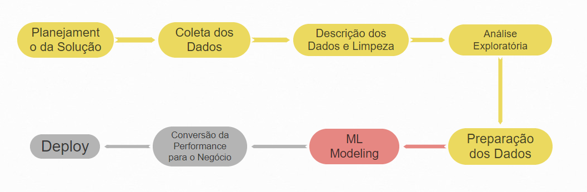

# TopBank Company
## Predicting Customer Churn

## 0.1 Contexto:
A TopBank é uma grande empresa de serviços bancários. Ela atua principalmente nos países da Europa oferecendo produtos financeiros, desde contas bancárias até investimentos, passando por alguns tipos de seguros e produto de investimento.

O modelo de negócio da empresa é do tipo serviço, ou seja, ela comercializa serviços bancários para seus clientes através de agências físicas e um portal online. 

O principal produto da empresa é uma conta bancária, na qual o cliente pode depositar seu salário, fazer saques, depósitos e transferência para outras contas. Essa conta bancária não tem custo para o cliente e tem uma vigência de 12 meses, ou seja, o cliente precisa renovar o contrato dessa conta para continuar utilizando pelos próximos 12 meses.

Segundo o time de Analytics da TopBank, cada cliente que possui essa conta bancária retorna um valor monetário de 15% do valor do seu salário estimado, se esse for menor que a média e 20% se esse salário for maior que a média, durante o período vigente de sua conta. Esse valor é calculado anualmente. 

Por exemplo, se o salário mensal de um cliente é de 1.000 reais e a média de todos os salários do banco é de 800 reais. A empresa, portanto, fatura 200 reais anualmente com esse cliente. Se esse cliente está no banco há 10 anos, a empresa já faturou 2.000 reais com suas transações e utilização da conta. 

Nos últimos meses, o time de Analytics percebeu que a taxa de clientes cancelando suas contas e deixando o banco, atingiu números inéditos na empresa. Preocupados com o aumento dessa taxa, o time planejou um plano de ação para diminuir taxa de evasão de clientes.

Preocupados com a queda dessa métrica, o time de Analytics da TopBottom, contratou você como consultor de Data Science para criar um plano de ação, com o objetivo de reduzir a evasão de clientes, ou seja, impedir que o cliente cancele seu contrato e não o renove por mais 12 meses. Essa evasão, nas métricas de negócio, é conhecida como Churn.

De maneira geral, Churn é uma métrica que indica o número de clientes que cancelaram o contrato ou pararam de comprar seu produto em um determinado período de tempo. Por exemplo, clientes que cancelaram o contrato de serviço ou após o vencimento do mesmo, não renovaram, são clientes considerados em churn.

Outro exemplo seria os clientes que não fazem uma compra à mais de 60 dias. Esse clientes podem ser considerados clientes em churn até que uma compra seja realizada. O período de 60 dias é totalmente arbitrário e varia entre empresas. 

Projeto retirado do Blog Seja Um Data Scientist
https://sejaumdatascientist.com/predicao-de-churn/

Projeto original disponível na plataforma Kaggle
https://www.kaggle.com/mervetorkan/churndataset

## 0.1 Tools, Requirementes
1. Linguagem: Python
2. Desenvolvimento e entrega do projeto: Jupyter Notebook
3. Cloud: Heroku
4. Plataforma de request: Google Sheets

## 0.2 Business Assumptions

###### 0.2.1 Sobre o benefício oferecido para retenção
Os times de Marketing em conjunto com o time de Negócios da empresa estipulou um programa de retenção de clientes que deverá seguir os seguintes critérios:
1. Serão ofertados Gift Cards aos clientes com valores de $200,00, $100,00 ou $50,00.
2. O teto máximo de custo total de Gift Cards não poderá ser superior a $50.000,00.

###### 0.2.2 Sobre o churn esperado
Dadas as probabilidades de churn que o modelo irá predizer teremos:
1. Clientes com probabilidade de churn acima de 99% sairão da base não importa o que lhes seja oferecido.
2. Clientes com probabilidade de churn entre 95% e 99% não deixarão a base contanto que lhers seja oferecido um Gift Card de pelo menos $200,00
3. Clientes com probabilidade de churn entre 90% e 95% não deixarão a base contanto que lhers seja oferecido um Gift Card de pelo menos $100,00
4. Clientes com probabilidade de churn entre 50% e 90% não deixarão a base contanto que lhers seja oferecido um Gift Card de pelo menos $50,00

## 0.3 Estratégia da Solução:

#### 0.3.1 Objetivos:
1. Qual a taxa atual de Churn da Top-Bank, qual é o seu custo financeiro para a empresa por perda de faturamento?
2. Qual a performance do modelo em classificar os clientes como churn?
3. Qual o retorno esperado, em termos de faturamento, se a empresa utilizar seu modelo para evitar o churn dos clientes?

#### 0.3.2 Proposta de Solução:
1. Definir a baseline de churn atual e qual é seu custo para a empresa.
2. Escolher métrica de performance, modelar o problema e treinar.
3. Definido a baseline (problema 1), scorar os clientes, suas probabilidades de churn, definir programa de giftcards, mensurar probabilidade de conversão de clientes em churn, e custo do programa. Retorno financeiro = Churn atual - (menos) Churn predito após programa de giftcards - (menos) custo do programa.

#### 0.3.3 Inputs:
1. Problema de negócio
2. Conjunto de dados com características de 10.000 clientes e seus status de churn

#### 0.3.4 Outputs:
1. Taxa atuai de CHURN, uma porcentagem em Jupyter Notebook (Porcentagem)
3. Métricas do modelo (Métrica F1-Score)
3. Receita gerada pela redução de churn (Valor em moeda)
4. Tabela de banco de dados SQL com todas as classificações
5. API com request/predict do tipo: | v1 | v2 | v3 | - 1/0

#### 0.3.5 Ciclos:
1. Criar um pipeline de dados funcional, de ponta a ponta (desde a coleta de dados até o 
    treinamento do modelo)
2. Entender os dados e limpa-los (buscar inconsistências) Análises de estatística
    descritiva de primeira ordem
3. Feature Engineering (criar variáveis que modelam o fenômeno)
4. Criar as hipóteses de negócio
5. Análise exploratória de dados para validar ou refutar hióteses
6. Definir métricas e treinar o modelo
7. Analisar métricas
8. Resultados e conclusão

## 0.4 Significado das features:

1. RowNumber: O número da linha
2. CustomerID: Identificador único do cliente
3. Surname: Sobrenome do cliente.
4. CreditScore: A pontuação de Crédito do cliente para o mercado de consumo.
5. Geography: O país onde o cliente reside.
6. Gender: O gênero do cliente.
7. Age: A idade do cliente.
8. Tenure: Número de anos que o cliente permaneceu ativo.
9. Balance: Valor monetário que o cliente tem em sua conta bancária.
10. NumOfProducts: O número de produtos comprado pelo cliente no banco.
11. HasCrCard: Indica se o cliente possui ou não cartão de crédito.
12. IsActiveMember: Indica se o cliente fez pelo menos uma movimentação na conta bancário dentro de 12 meses.
13. EstimateSalary: Estimativa do salário mensal do cliente.
14. Exited: Indica se o cliente está ou não em Churn.

## 0.5 Sumário:

## 0.6 Próximos Passos:

## 0.7 Estágio Atual do Projeto:

