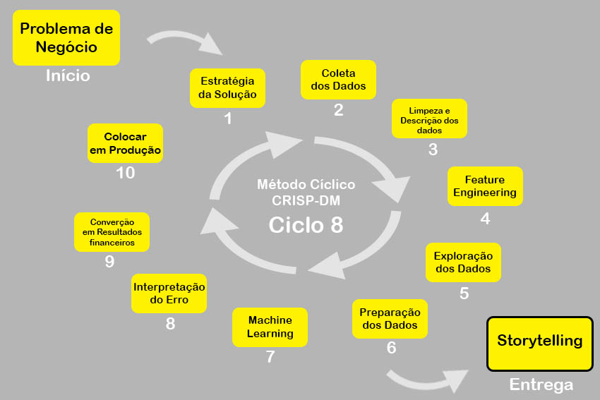

# TopBank Company
## Predicting Customer Churn

## 1.0 Contexto:
A TopBank é uma grande empresa de serviços bancários. Ela atua principalmente nos países da Europa oferecendo produtos financeiros, desde contas bancárias até investimentos, passando por alguns tipos de seguros e produto de investimento.

O modelo de negócio da empresa é do tipo serviço, ou seja, ela comercializa serviços bancários para seus clientes através de agências físicas e um portal online. 

O principal produto da empresa é uma conta bancária, na qual o cliente pode depositar seu salário, fazer saques, depósitos e transferência para outras contas. Essa conta bancária não tem custo para o cliente e tem uma vigência de 12 meses, ou seja, o cliente precisa renovar o contrato dessa conta para continuar utilizando pelos próximos 12 meses.

Segundo o time de Analytics da TopBank, cada cliente que possui essa conta bancária retorna um valor monetário de 15% do valor do seu salário estimado, se esse for menor que a média e 20% se esse salário for maior que a média, durante o período vigente de sua conta. Esse valor é calculado anualmente. 

Por exemplo, se o salário mensal de um cliente é de 1.000 reais e a média de todos os salários do banco é de 800 reais. A empresa, portanto, fatura 200 reais anualmente com esse cliente. Se esse cliente está no banco há 10 anos, a empresa já faturou 2.000 reais com suas transações e utilização da conta. 

Nos últimos meses, o time de Analytics percebeu que a taxa de clientes cancelando suas contas e deixando o banco, atingiu números inéditos na empresa. Preocupados com o aumento dessa taxa, o time planejou um plano de ação para diminuir taxa de evasão de clientes.

Preocupados com a queda dessa métrica, o time de Analytics da TopBottom, contratou você como consultor de Data Science para criar um plano de ação, com o objetivo de reduzir a evasão de clientes, ou seja, impedir que o cliente cancele seu contrato e não o renove por mais 12 meses. Essa evasão, nas métricas de negócio, é conhecida como Churn.

De maneira geral, Churn é uma métrica que indica o número de clientes que cancelaram o contrato ou pararam de comprar seu produto em um determinado período de tempo. Por exemplo, clientes que cancelaram o contrato de serviço ou após o vencimento do mesmo, não renovaram, são clientes considerados em churn.

Outro exemplo seria os clientes que não fazem uma compra à mais de 60 dias. Esse clientes podem ser considerados clientes em churn até que uma compra seja realizada. O período de 60 dias é totalmente arbitrário e varia entre empresas. 

Projeto retirado do Blog Seja Um Data Scientist
https://sejaumdatascientist.com/predicao-de-churn/

Projeto original disponível na plataforma Kaggle
https://www.kaggle.com/mervetorkan/churndataset

## 2.0 Tools, Requirementes
1. Linguagem: Python
2. Desenvolvimento e entrega do projeto: Jupyter Notebook
3. Cloud: Heroku
4. Plataforma de request: Google Sheets

## 3.0 Business Assumptions

###### 3.1 Sobre o benefício oferecido para retenção
Os times de Marketing em conjunto com o time de Negócios da empresa estipulou um programa de retenção de clientes que deverá seguir os seguintes critérios:
- Clientes com propensidade de churn maior que 99% - Farão churn não importa o que se faça
- Clientes com propensidade de churn entre 95% e 99% receberão 200,00 de Gift Card
- Clientes com propensidade de churn entre 90% e 95% receberão 100,00 de Gift Card
- Clientes com propensidade de churn abaixo de 90% receberão 50,00 de Gift Card
- O total de budgit para a ação é de 10.000,00

## 4.0 Estratégia da Solução:
#### 4.1 Objetivos:
1. Qual a taxa atual de Churn da Top-Bank, qual é o seu custo financeiro para a empresa por perda de faturamento?
2. Qual a performance do modelo em classificar os clientes como churn?
3. Qual o retorno esperado, em termos de faturamento, se a empresa utilizar seu modelo para evitar o churn dos clientes?

#### 4.2 Proposta de Solução:
1. Definir a baseline de churn atual e qual é seu custo para a empresa.
2. Escolher métrica de performance, modelar o problema e treinar.
3. Definido a baseline (problema 1), scorar os clientes, suas probabilidades de churn, definir programa de giftcards, mensurar probabilidade de conversão de clientes em churn, e custo do programa. Retorno financeiro = Churn atual - (menos) Churn predito após programa de giftcards - (menos) custo do programa.

#### 4.3 Inputs:
1. Problema de negócio
2. Conjunto de dados com características de 10.000 clientes e seus status de churn

#### 4.4 Outputs:
1. Taxa atuai de CHURN, uma porcentagem em Jupyter Notebook (Porcentagem) e o seu custo para a empresa.
3. Definir uma métrica que esteja alinhada com o problema de negócio e o modelo de negócio da empresa.
3. Receita gerada pela redução de churn (Valor em moeda)
4. API com request através de Google Sheets do tipo: | v1 | v2 | v3 | - 1/0

#### 4.5 Ciclos:
1. Criar um pipeline de dados funcional, de ponta a ponta (desde a coleta de dados até o 
    treinamento do modelo)
2. Entender os dados e limpa-los (buscar inconsistências) Análises de estatística
    descritiva de primeira ordem
3. Feature Engineering (criar variáveis que modelam o fenômeno)
4. Criar as hipóteses de negócio
5. Análise exploratória de dados para validar ou refutar hióteses
6. Definir métricas e treinar o modelo
7. Analisar métricas
8. Resultados e conclusão

## 5.0 Top 3 Data Insights
1. Clientes com 3 ou 4 produtos têm maior probabilidade de churn, com 80% e 100% de churn 
2. Membros ativos são 47% menos propensos ao churn
3. Média de idade de clientes em churn é de 45, já os em não churn é de 37
## 6.0 Machine Learning Model Applied
XGBoost Classifier
## 7.0 Machine Learning Performance

## 8.0 Business Results
Em uma base com 2000 clientes, utilizando um modelo de Machine Learning para ranquear os clientes de acordo com a sua propensão ao CHURN, e ordenando-os de acordo com o ROI, o modelo obteve um LIFT de: $566533.04 em relação à um método aleatório. O modelo foi melhor em uma razão de: 23X
## 9.0 Leasson Learned

## 10.0 Sumário:
* RowNumber: O número da linha
* CustomerID: Identificador único do cliente
* Surname: Sobrenome do cliente.
* CreditScore: A pontuação de Crédito do cliente para o mercado de consumo.
* Geography: O país onde o cliente reside.
* Gender: O gênero do cliente.
* Age: A idade do cliente.
* Tenure: Número de anos que o cliente permaneceu ativo.
* Balance: Valor monetário que o cliente tem em sua conta bancária.
* NumOfProducts: O número de produtos comprado pelo cliente no banco.
* HasCrCard: Indica se o cliente possui ou não cartão de crédito.
* IsActiveMember: Indica se o cliente fez pelo menos uma movimentação na conta bancário dentro de 12 meses.
* EstimateSalary: Estimativa do salário mensal do cliente.
* Exited: Indica se o cliente está ou não em Churn.

## 11.0 Próximos Passos: 
- Conversar com os líderes para entender melhor a feature Balance, e entender porque ela apresenta comportamento diferente de país para país.
- Entender melhor o Salário Estimado, valores muito baixos para serem tidos como salário anual.
- Coletar mais atributos dos clientes

## 12.0 Estágio Atual do Projeto:

**Criar Storytelling para apresentar os resultados.**

